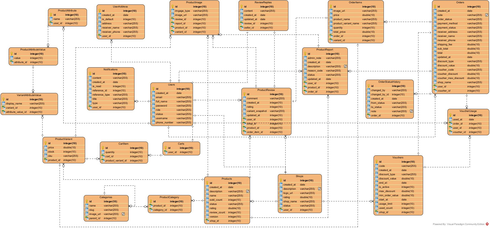
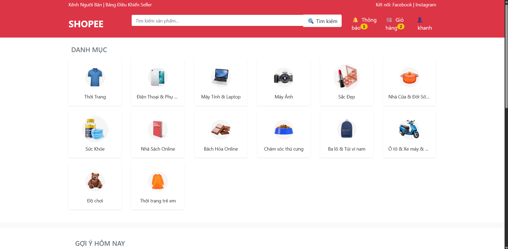
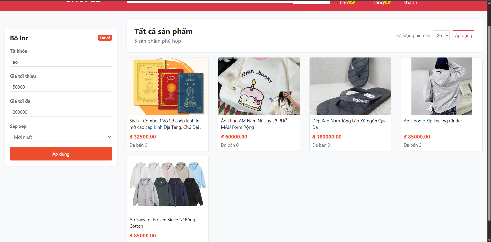
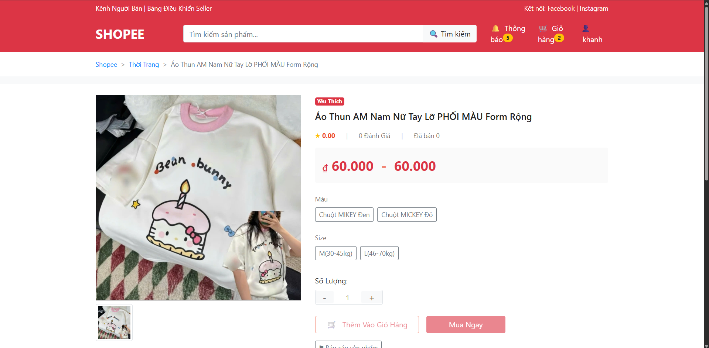
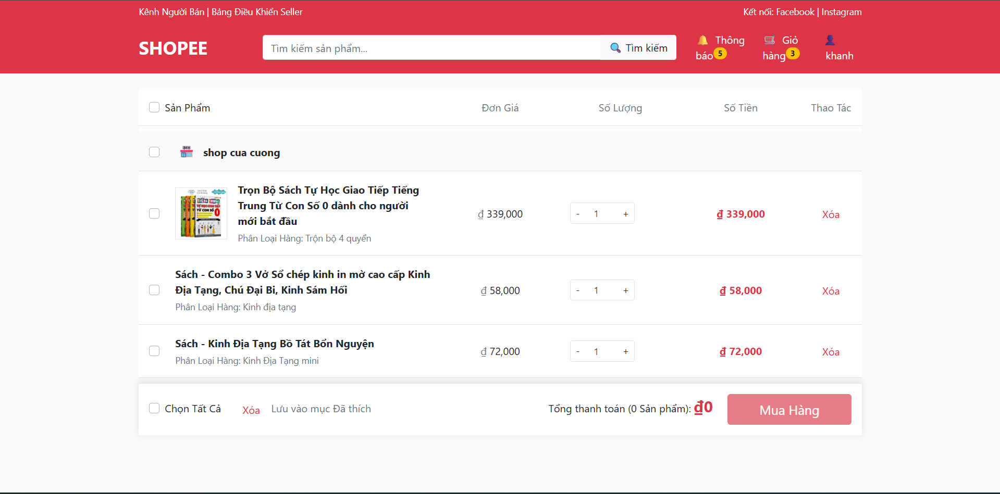
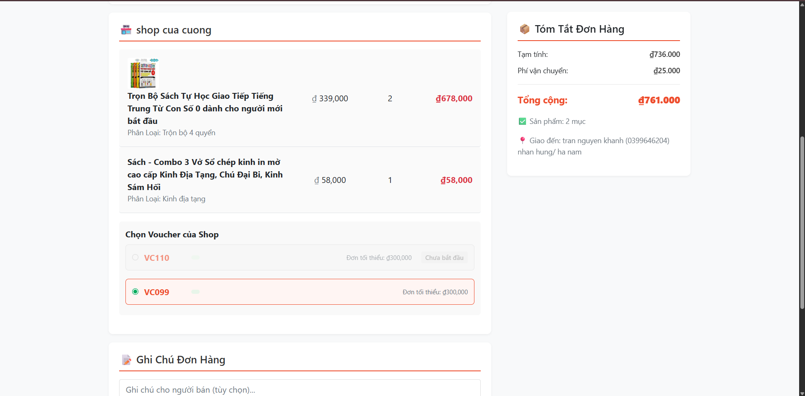
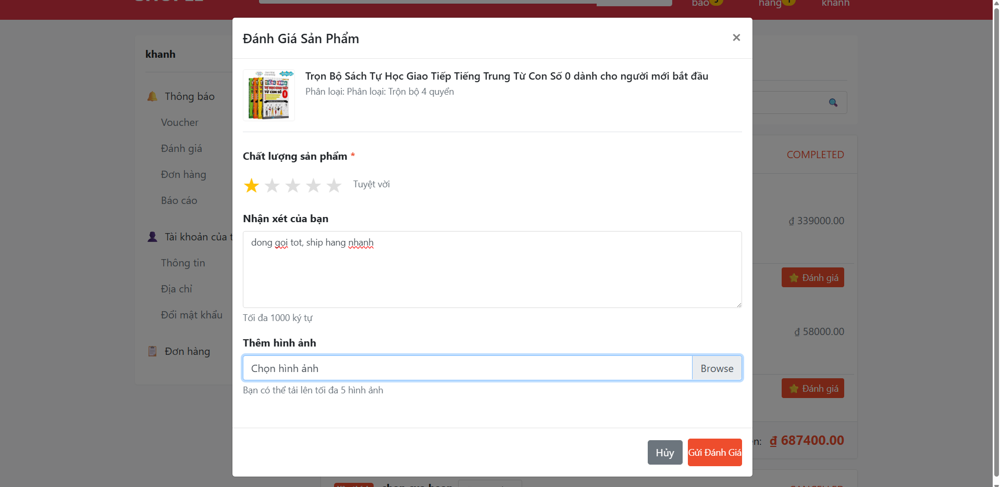
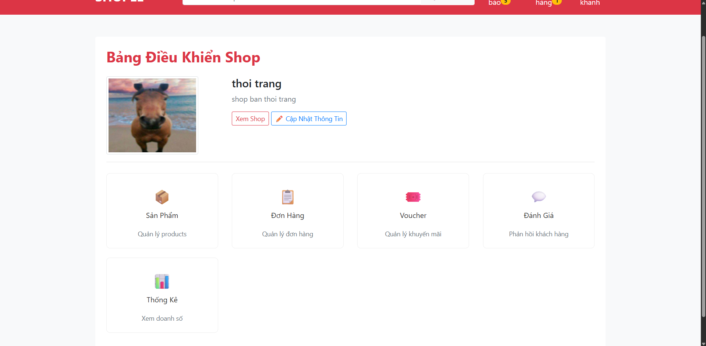
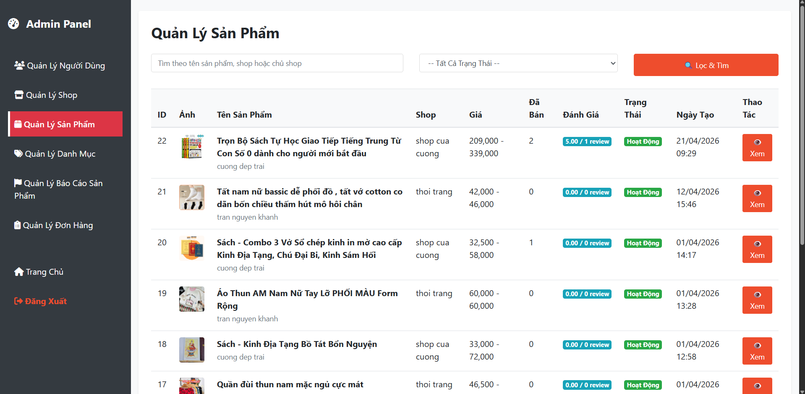

# E-Commerce System

A full-stack e-commerce web application built using Spring MVC and Thymeleaf, 
supporting product management, shopping cart, order processing, voucher system, 
product reviews, and user authentication.

## Tech Stack
- Java 21
- Spring MVC
- Spring Security
- MySQL
- JPA / Hibernate
- Thymeleaf (for frontend)

## Features
### User Features
- User registration and login
- Product browsing and searching
- View product details and variants
- Shopping cart management
- Voucher application during checkout
- Order history and tracking
- Product reviews and ratings
- Manage user profile and shipping addresses
### Seller Features
- Manage shop information
- Create, edit, and delete products and variants
- Process orders and update order status
- View sales reports and analytics
### Admin Features
- Manage users and sellers
- Manage products and categories
- Handle product reports and moderation
### System Features
- Secure authentication and authorization using Spring Security
- Responsive design with Thymeleaf templates
- Relational database management with MySQL and JPA/Hibernate
## Application Architecture
The application follows the MVC (Model-View-Controller) architecture.

- Controller layer handles HTTP requests and page navigation
- Service layer contains business logic
- Repository layer manages database operations
- Thymeleaf templates render dynamic UI pages
## Folder Structure
```
src/main/java/com/prj/ecommerce
├── controller     # Handle web requests
├── service        # Business logic
├── repository     # Data access layer
├── entity         # Database entities
├── dto            # Data transfer objects
├── config         # Spring configurations
├── exception      # Exception handling
└── common         # Shared utilities

src/main/resources/templates
├── admin
├── user
└── fragments
```
## Database Design


## Running the Application
1. Clone the repository
```git clone https://github.com/tnKhanh0406/ecommerce.git```
2. Configure the database connection, cloudinary, redis in `application.properties`
3. Run application using your IDE or command line
```docker compose up -d```

## Screenshots
### Home Page

### Product browsing and searching

### View product details

### Cart Management

### Order 

### Rating

### Seller Dashboard

### Admin Dashboard
